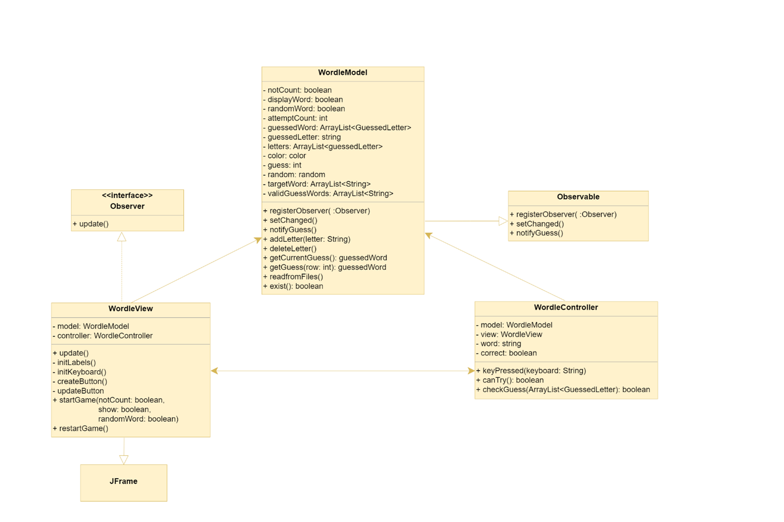
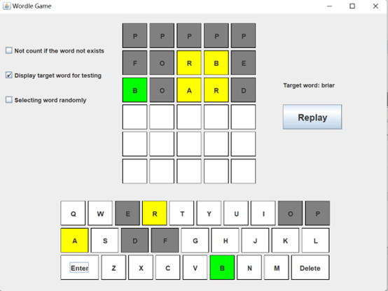
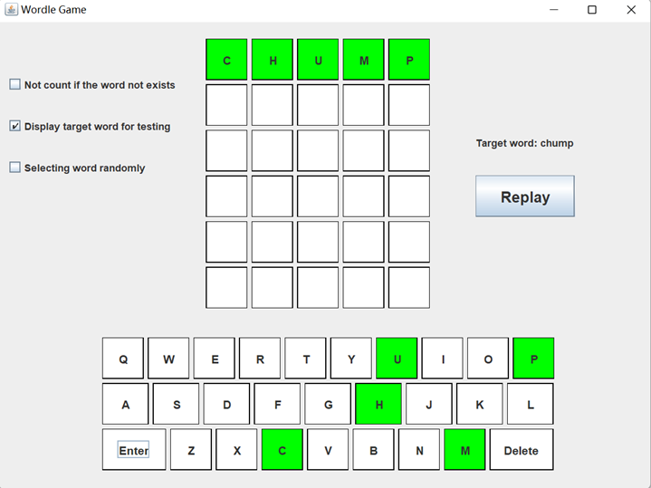

# Wordle - Java ☘️

> An Java version Wordle based on Swing
>
> One version will have a Graphical User Interface (GUI) and the other version will have a command-line interface (CLI)
>
> The implementation of this game is based on **Model, View and Controller** (MVC) style with **Observer Pattern**

## How to play  📖

- Guess the Wordle word in tries for no more than 6 time.

- Each guess must be a valid word with the length of **FIVE**.
- For each letter in a valid word(ie. in a wordlist) you enter, it will turn to:
  - **Green** if it is in the answer with correct position.
  - **Yellow** if it is in the answer with the wrong position.
  - **Gray** if it is not in the answer.

## UML ⭐

## Project display 🎰

- Interface

## Contribution 👨‍👨‍👦‍👦

Looking forward to more contributions：

- I will respond positively to bugs and suggestions in the Issues section.

